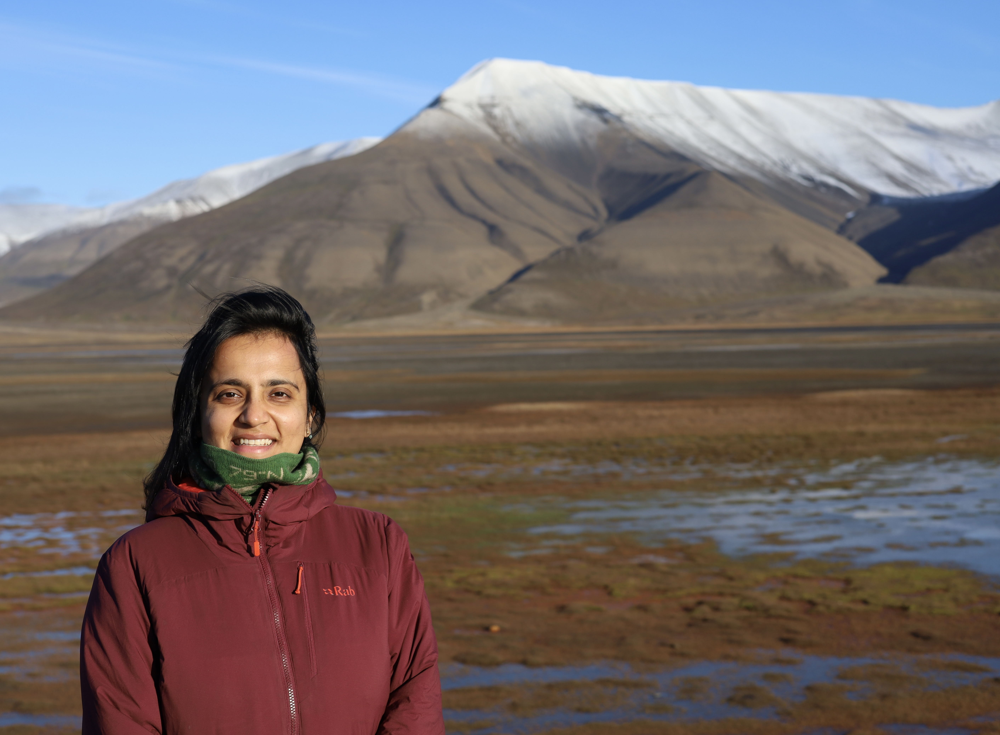

#

:::: {.columns}

::: {.column width="35%"}

{width=100%}

:::

::: {.column width="65%"}

## Hi, I'm Cheshtaa.

I've always been fascinated by the invisible world. The fact that microscopic organisms, unseen to the naked eye, can shape entire ecosystems continues to inspire the questions I ask as a scientist.

My research sits at the intersection of **molecular ecology, microbial ecology, bioinformatics and environmental sequencing**, where I use DNA-based approaches to understand how microbial communities respond to environmental change.

During my PhD at the **University Centre in Svalbard (UNIS)**, I spent several years studying microbial eukaryote communities across Arctic fjords using one of the longest environmental DNA time series collected in the European Arctic. That work revealed how seasonal light cycles, hydrography and changing environmental conditions shape microbial biodiversity in one of Earth's most rapidly changing ecosystems.

Today, my research is expanding beyond marine systems into **plant microbiomes, sustainable agriculture and ultimately space biology**, where I hope to understand how beneficial microbial communities can help support resilient ecosystems both on Earth and during future long-duration space missions.

:::

::::

---

# Fieldwork

:::: {.columns}

::: {.column width="33%"}

{.field-photo}

{.field-photo}

:::

::: {.column width="33%"}

{.field-photo}

{.field-photo}

:::

::: {.column width="33%"}

{.field-photo}

{.field-photo}

:::

::::

---

# My Research Philosophy

Microorganisms are often overlooked because we cannot see them, yet they underpin nearly every ecosystem on our planet. I believe that understanding these hidden communities is fundamental to addressing some of the greatest environmental challenges of our time—from climate change in the Arctic to sustainable food production and future human exploration of space.

By combining field observations, molecular techniques and computational analyses, I aim to uncover ecological patterns that would otherwise remain invisible.

---

# Research Interests

- ❄ Arctic microbial ecology
- 🌱 Plant microbiomes
- 🧬 Molecular ecology
- 💻 Bioinformatics
- 🚀 Space biology
- 🌍 Global environmental change

---

# My Journey

### 🇺🇸 Current — Postdoctoral Researcher

Postdoctoral research focusing on plant microbiomes, sustainable agriculture and the foundations of space biology.

**The University of Mississippi (Ole Miss)**

---

### 🇳🇴 2019–2025 — PhD in Arctic Marine Molecular Ecology

**University Centre in Svalbard (UNIS)**

Research focused on long-term microbial eukaryote community dynamics across Arctic fjords using environmental DNA and metabarcoding.

---

### 🇪🇺 2016–2018 — Erasmus Mundus Joint Master's Programme (MER)

Master's in **Marine Environment and Resources (MER)**

**University of the Basque Country**  
**University of Bordeaux**  
**University of Liège**  
**UiT The Arctic University of Norway**

---

# Beyond Research

Away from research, I enjoy capturing and painting Arctic landscapes—often inspired by the calm, happy style of Bob Ross. When I'm not exploring microbial communities, you'll usually find me on a basketball court, strength training, travelling to new places, or reading thought-provoking dystopian fiction that explores society, politics and human nature. These interests provide a creative balance to my research and continually remind me to look at the world from different perspectives.