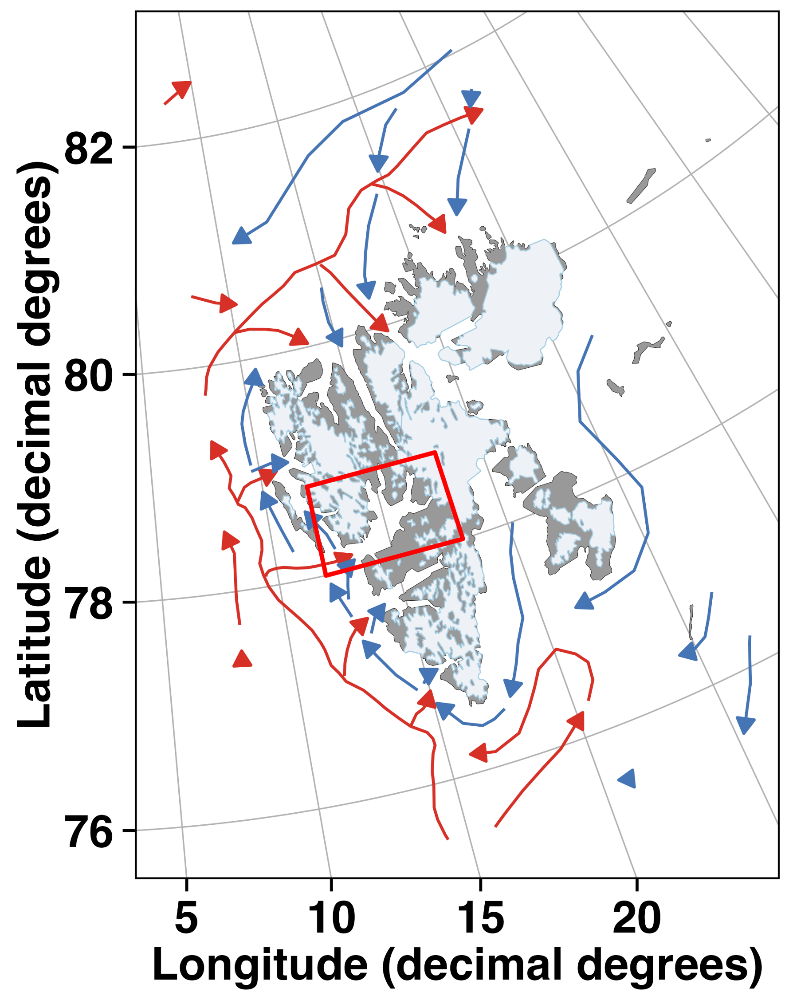

# 

{width=50%}

---

## Overview

During my PhD at the University Centre in Svalbard (UNIS), I investigated how microbial eukaryotic communities respond to environmental variability across Arctic fjords. Using one of the longest environmental DNA time series from the European Arctic, this work explored seasonal succession, hydrographic influences and long-term community stability.

---

## Research Questions

- How do microbial eukaryotic communities vary across seasons and contrasting Arctic fjords?
- What roles do light availability, hydrography and other environmental gradients play in shaping microbial biodiversity?
- How stable are Arctic microbial communities over annual to decadal timescales in a rapidly changing climate?

---

# Study Area

## Isfjorden: A Natural Laboratory for Arctic Microbial Ecology

My PhD research was conducted within **Isfjorden**, which is the largest fjord system on the west coast of Svalbard and provides a natural laboratory for studying environmental variability.

Throughout my PhD, I investigated microbial eukaryotic communities across this fjord system using environmental DNA and long-term ecological observations. The project resulted in three first-author publications, each addressing complementary aspects of Arctic microbial ecology.

{width=50% fig-align="center"}

*Map of Svalbard showing the major ocean currents influencing the archipelago. The red box highlights Isfjorden, the primary study area used throughout my PhD research.*

---

# PhD Publications

## Paper 1 — Published

### [Chitkara *et al.* (2024)](https://doi.org/10.1016/j.pocean.2024.103317)

### Research summary

This study is a comparative synthesis of phytoplankton bloom dynamics across three Arctic fjords (Greenland, Norway, and Svalbard). 

### Key findings

- Spring phytoplankton blooms followed remarkably similar seasonal patterns across Arctic fjords despite contrasting environmental conditions.
- Summer and autumn blooms were controlled by local hydrographic processes, including glacier-driven upwelling, terrestrial runoff and wind mixing.
- The study demonstrates that future climate change will influence Arctic primary production differently among fjords depending on their physical setting.

---

## Paper 2 — Submitted

### Comparative microbial community dynamics across contrasting Arctic fjords

This manuscript compares microbial eukaryotic communities between two contrasting fjord systems within the Isfjorden on Svalbard. Based on a year-long monthly environmental time series, the study investigates how differences in hydrography, light availability and local environmental conditions shape seasonal and spatial patterns in microbial biodiversity.

*(Currently under peer review.)*

---

## Paper 3 — In Preparation

This work expands the understanding of Arctic microbial community dynamics over a period of 10 years in the high-Arctic

*(Currently in preparation)*

---

# Co-author Publications

In addition to my first-author research, I have contributed to collaborative projects under a similar theme.

---

### [Vonnahme, T.R., **Chitkara, C.**, *et al.* (2025)]( https://doi.org/10.1002/lno.70159)

### Research summary

This collaborative study analyzed 3 long-term monitoring datasets including those from Nuup Kangerlua (Godthåbsfjord, 15 yrs), West Greenland, along with Isfjorden on Svalbard (10 yrs) and Ramfjorden in northern Norway (4 yrs) to investigate long-term changes in Arctic microplankton diversity and identify the environmental mechanisms driving ecosystem change. 

### Key findings

- Identified an abrupt regime shift in microplankton species richness around 2013.
- Demonstrated that changes in Atlantic Water inflow altered nutrient availability and hydrographic conditions.
- Highlighted the importance of long-term monitoring for detecting climate-driven ecosystem change in Arctic fjords. 