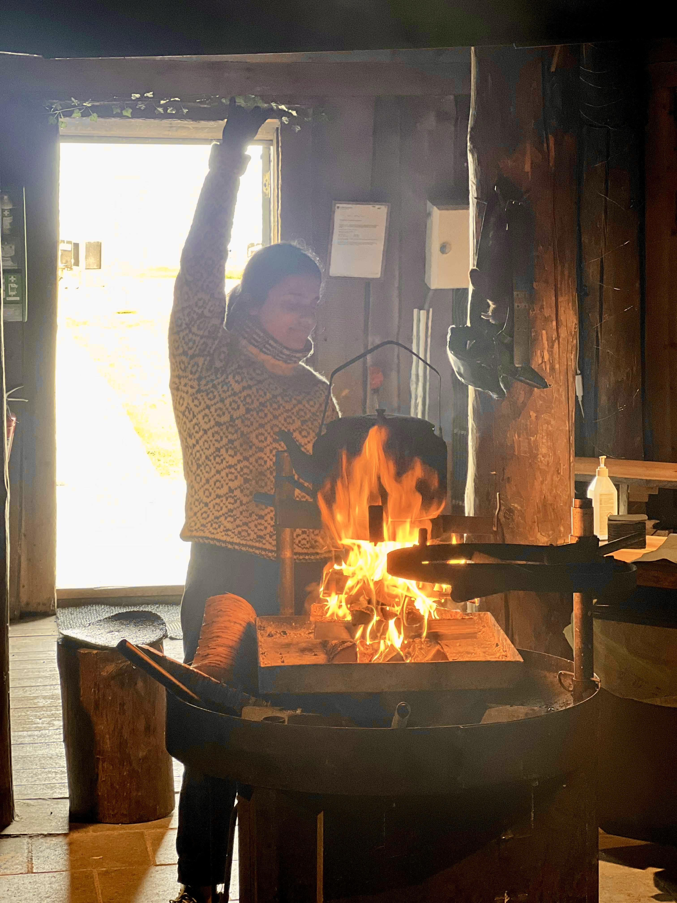
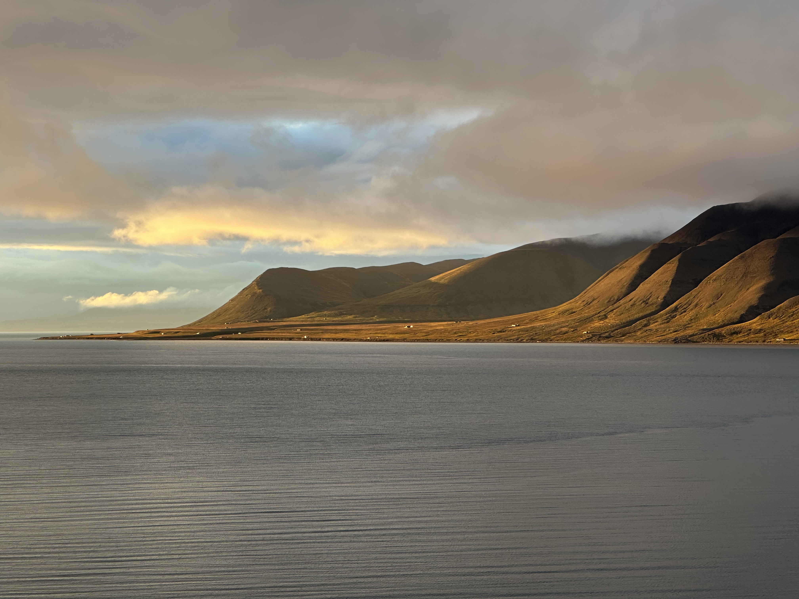

## August 2025

After completing my PhD, I decided to step outside academia for a few months to see what life beyond research might look like. During the summer of 2025, I worked as a **city guide** in Longyearbyen, Svalbard, leading visitors through one of the world's northernmost settlements.

My days were incredibly varied. One moment I was guiding walking tours through town, and the next I was flipping pancakes, serving reindeer soup, or welcoming guests while telling stories about **Willem Barentsz**, Arctic exploration, polar bears and life in the High Arctic.

Although the tours were primarily centred around the history of Longyearbyen, I naturally found myself talking about science instead. I shared stories from my five years living in Svalbard, my PhD research, the fascinating work of friends and colleagues, and what we are witnessing firsthand as residents of a rapidly changing Arctic.

To my surprise, these were often the conversations people remembered most. Visitors were genuinely curious about Arctic research and what scientists are discovering in one of the fastest-changing regions on Earth. Rather than pulling me away from academia, this experience reinforced how much I enjoy connecting people with science through storytelling.

***

# Gallery

:::: {.columns}

::: {.column}
{.news-photo}

*Talking to visitors about polar bears and their remarkable sense of smell at a historic hunting cabin.*
:::

::: {.column}
{.news-photo}

*Preparing for visitors to arrive at the hunting cabin.*
:::

::: {.column}
{.news-photo}

*The incredible view from the hunting cabin in Adventdalen.*
:::

::::

***
