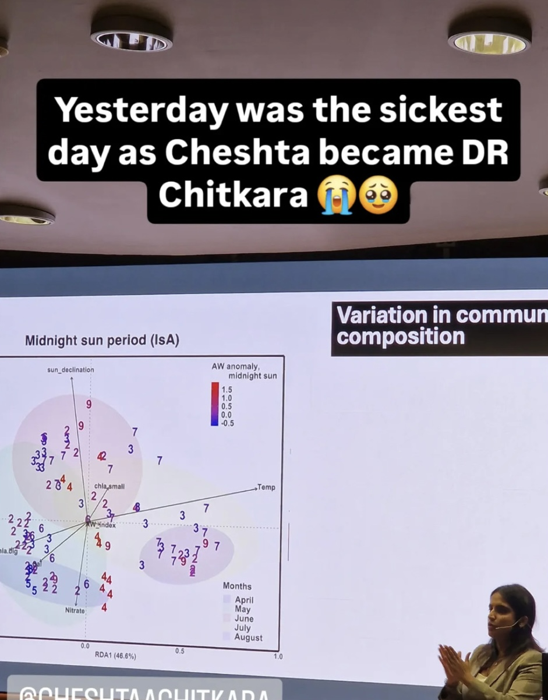
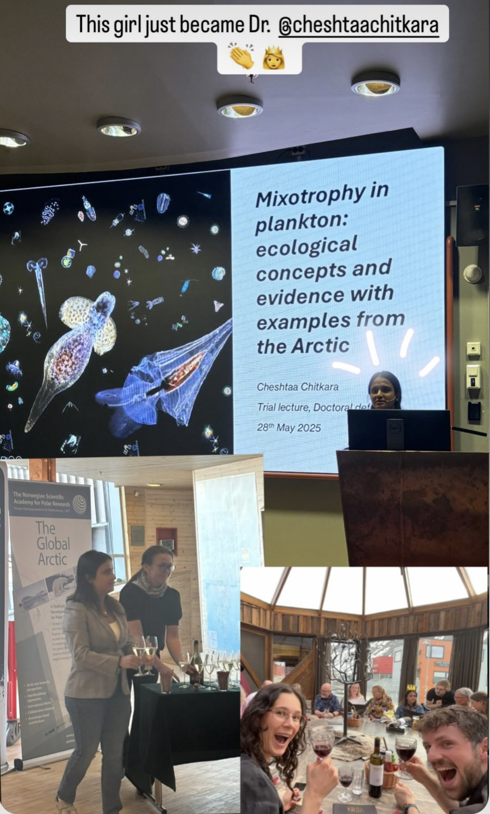

# 

## May 2025

After five and a half years of research, fieldwork, sequencing, coding and writing, I successfully defended my PhD in **Arctic microbial ecology** at the **University Centre in Svalbard (UNIS)** and **University of Agder (UiA)**.

Interested in learning more about the science behind my PhD?  
<a href="arctic.qmd" class="hero-button">
🧬 Explore My PhD Research
</a>

Beyond the science, this PhD completely shaped who I am. It challenged me, humbled me, introduced me to lifelong friends and mentors, and gave me the privilege of calling one of the most extraordinary places on Earth home for over five years.

***

# My PhD by the Numbers

- ❄️ **5.5 years** living and conducting research in Svalbard
- 🚢 **Countless** research cruises and field expeditions
- 🧪 **Hundreds** of environmental samples collected and processed
- 🧬 **Millions** of DNA sequences analysed
- 💻 **Thousands** of hours spent coding and analysing data
- 📄 **4 peer-reviewed journal publications**
- 🌌 **Hundreds** of northern lights witnessed
- ☕ **An unreasonable amount** of coffee consumed

***

# Gallery
:::: {.columns}

::: {.column}
{.news-photo}
:::

::: {.column}
{.news-photo}
:::

::::

:::: {.columns}

::: {.column}
{.news-photo}
:::

::::

Wishes from my friends!

:::: {.columns}

::: {.column}
{.news-photo}

*Opened a million presents that day! :')*
:::

::: {.column}
{.news-photo}

*The one with the supervisor!*
:::

::::

***

# Featured By

My PhD defence was highlighted by two of the major Arctic research programmes that supported my work throughout my doctorate.

:::: {.columns}

::: {.column}

### ❄️ FACE-IT

The successful defence of my thesis marked the **fourth PhD completed within the EU Horizon 2020 FACE-IT project**, which investigates the impacts of climate change on Arctic fjord ecosystems.

➡️ [Read the FACE-IT article →](https://www.face-it-project.eu/2025/05/28/cheshtaa-chitkara-fourth-phd-thesis-defended-within-face-it/){target="_blank"}

:::

::: {.column}

### 🌊 The Nansen Legacy

My defence was also featured by **The Nansen Legacy**, Norway's largest Arctic marine research programme, highlighting my work on microbial eukaryotes, seasonality and Atlantification in Arctic fjords.

➡️ [Read the Nansen Legacy article →](https://arvenetternansen.com/2025/06/02/disputation/){target="_blank"}

:::

::::

***

# Looking Back

People often say that a PhD is about earning a degree. Looking back, I think it was about much more than that.

It taught me resilience when experiments failed, patience when analyses refused to work, and confidence to tackle questions that initially seemed impossible. It also gave me lifelong friendships, unforgettable adventures across the Arctic, and the opportunity to contribute, however modestly, to our understanding of one of the fastest changing regions on Earth.

While closing this chapter was bittersweet, it also marked the beginning of an exciting new one. I left Svalbard with immense gratitude for everyone who made the journey possible and with great excitement for the adventures still to come.