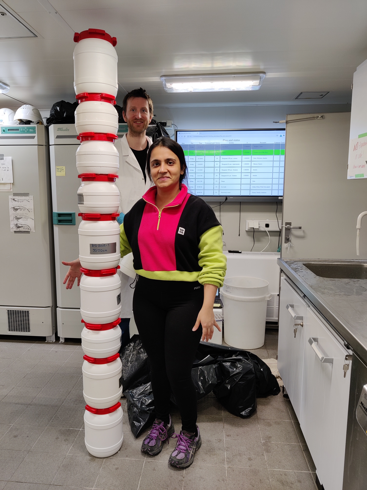
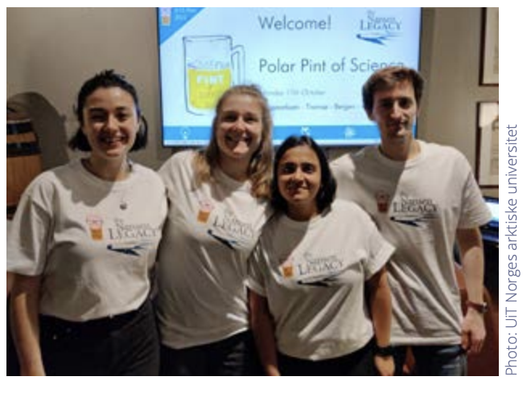

# Outreach Philosophy

I believe science should be accessible to everyone. Whether speaking to school children, university students, tourists or fellow researchers, my goal is always the same—to make scientific discoveries understandable, engaging and relevant.

The ability to communicate research clearly is just as important as conducting it.

---

# Science Communication

## Polar Bears International (2026)

{width=60% fig-align="center"}

: *Polar Bears International glasshouse featuring Annie*

Following my PhD, I worked as a **Science Communicator** with **Polar Bears International** in Svalbard. During the summer tourist season, I engaged with visitors arriving on expedition cruise ships, discussing Arctic ecosystems, polar bear ecology, sea ice loss and the impacts of climate change on the rapidly changing Arctic environment.

This role strengthened my passion for communicating complex scientific concepts to diverse audiences and demonstrated the importance of connecting scientific research with public understanding.

---

# Inspiring Future Scientists

## Open Day Events at UNIS

{width=60% fig-align="center"}

: *Mirror Mirror on the wall, whos the tallest of them all*

Throughout my PhD, I helped organize and deliver several public outreach events at the University Centre in Svalbard (UNIS). Together with colleagues, we designed interactive, hands-on activities that introduced children and families to Arctic science, climate change and microbial life through fun and engaging experiments.

These events aimed to spark curiosity about the natural world while encouraging the next generation of scientists. Although the picture above doesnt show the work we did that day, but is still a little sneak peak into the fieldwork life of a marine biologist, that we made sure to show the students.

---

## Pint of Science

{fig-align="center" width="60%"}

: *Blurry picture, but happy faces. Featuring my PhD ride-or-dies from UNIS, Svalbard! ❤️*

As part of **The Nansen Legacy**, one of Norway's largest Arctic research initiatives, I helped organise the **Pint of Science**, an international science communication festival that brings researchers and the public together in informal settings. Through this event, I had the opportunity to share my PhD research on Arctic microbial ecology with audiences outside academia and discuss why microscopic organisms are fundamental to understanding a rapidly changing Arctic.

👉 [The Nansen Legacy – PhD Fellows](https://arvenetternansen.com/phd-fellows/)

---

# Science Through Creativity

{fig-align="center" width="60%"}

My artwork during a seasonal cruise during the NL project was also featured in one of their reports, highlighting not only my interest, but also what I did onboard those 3 weeks of internet-less fieldwork in -30°C.

During my PhD, I wrote a science-inspired poem for the Longyearbyen community that reflected on my life leading upto Svalbard, my research and the hidden microbial world. The poem was shared during local outreach activities and became one of my favourite examples of using creativity to communicate science beyond traditional academic formats.

[📖 Read the poem →](poem.qmd){.hero-button}

---

# Science Writing

Communicating science through writing has been another rewarding aspect of my outreach activities. During the **The Nansen Legacy** research expedition aboard *R/V Kronprins Haakon*, I wrote a blog for the **Norwegian Polar Institute**, sharing my experiences as a PhD researcher and highlighting why the smallest organisms in the Arctic Ocean play such an important role in understanding ecosystem change.

Rather than focusing solely on scientific results, the blog offers a behind-the-scenes perspective on Arctic fieldwork—from life aboard an icebreaker and sampling on sea ice to the excitement (and occasional sea sickness!) of conducting research in one of the world's most extreme environments. It was an opportunity to make Arctic science more accessible and to show why, as the title suggests, *tiny Arctic wildlife matters*.

[📖 Read the blog: *Tiny Arctic Wildlife Matters* →](https://npolar.no/en/newsarticle/tiny-arctic-wildlife-matters/)

---

