# Teaching & Mentorship

During my PhD at the University Centre in Svalbard (UNIS), and following the completion of my doctorate, I contributed to teaching through lectures, laboratory practicals, field excursions and research supervision across undergraduate, Master's and PhD-level courses.

---

## Courses

### AB-202 — Arctic Marine Biology (Bachelor)

Contributed to laboratory practicals, field-based teaching and marine sampling exercises, introducing undergraduate students to Arctic marine ecosystems, biodiversity and ecological field methods. 

:::: {.columns}

::: {.column}
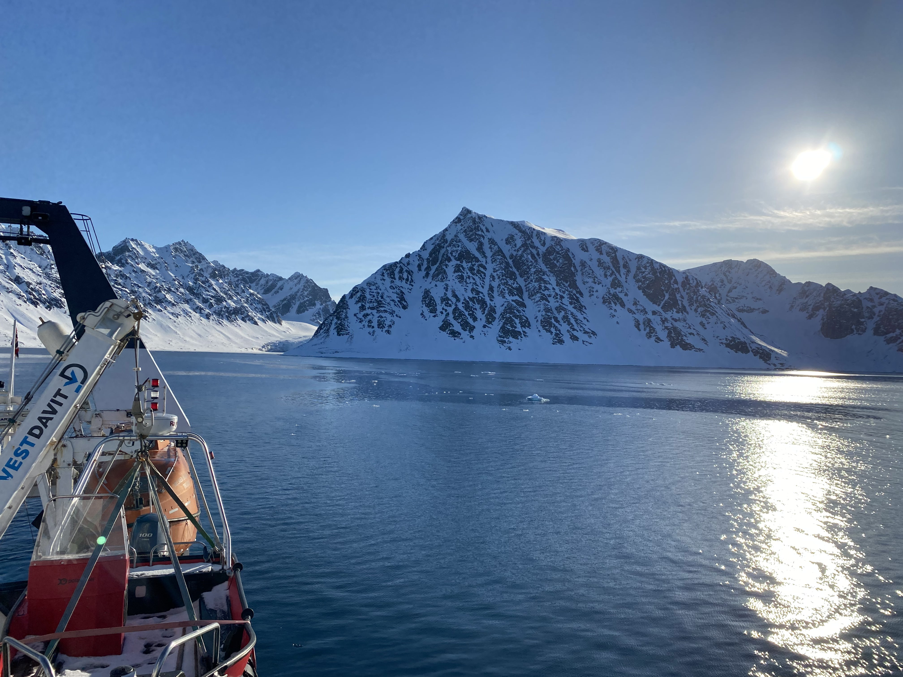{.field-photo}

*Fieldwork views from 80°N on the bachelor course aboard R/V Helmer Hansen.*
:::

::: {.column}
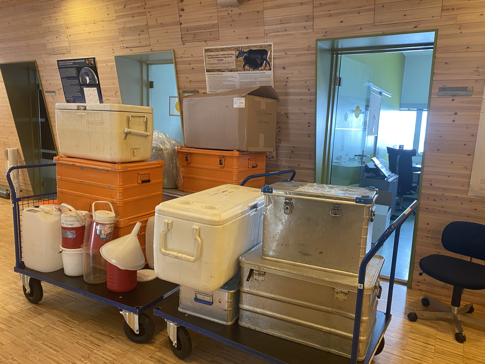{.field-photo}

*Less than a week worth of packing for the student cruise!*
:::

::: {.column}
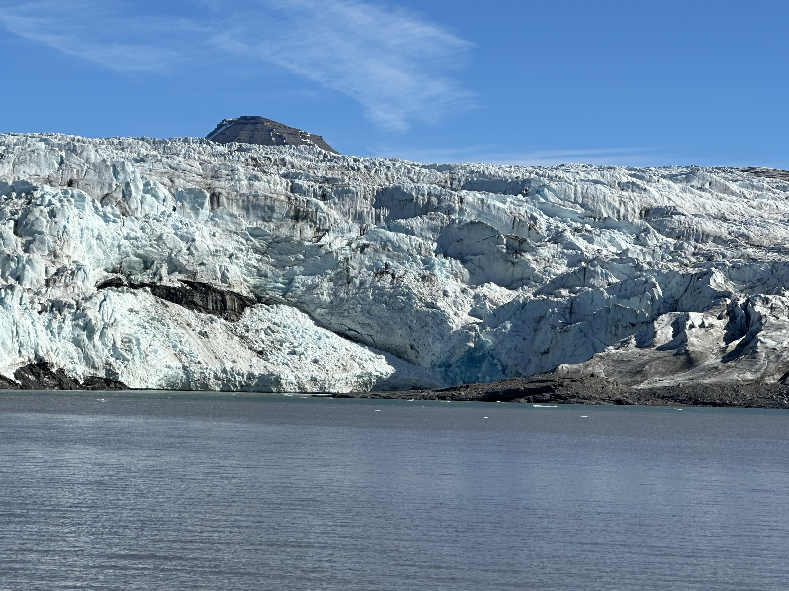{.field-photo}
*Our sampling site was right infront of this!*
:::

::: {.column}
{.field-photo}
*This device (CTD) measures Conductivity, Temperature and Density and a million other variables!*
:::

::::

---

### AB-332/832 — Arctic Marine Molecular Ecology (Master's & PhD)

Contributed to lectures and practical teaching covering environmental DNA (eDNA), molecular ecology, metabarcoding, biodiversity assessment and bioinformatic approaches used to investigate Arctic marine ecosystems. 

:::: {.columns}

::: {.column}
{.field-photo}

*Helping hands!*
:::

::: {.column}
{.field-photo}

*What we sample for the course.*
:::

::: {.column}
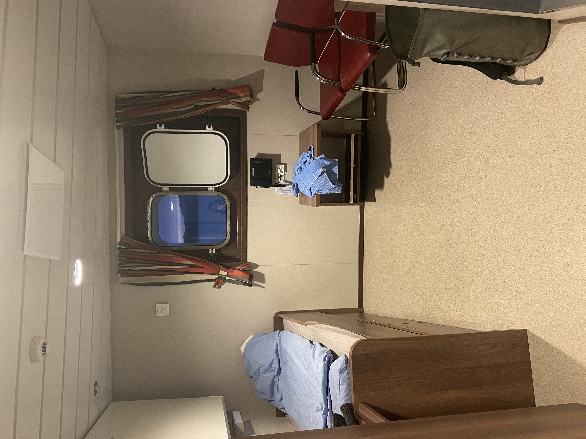{.field-photo}

*My very first teacher cabin aboard R/V Polarsyssel.*
:::

::: {.column}
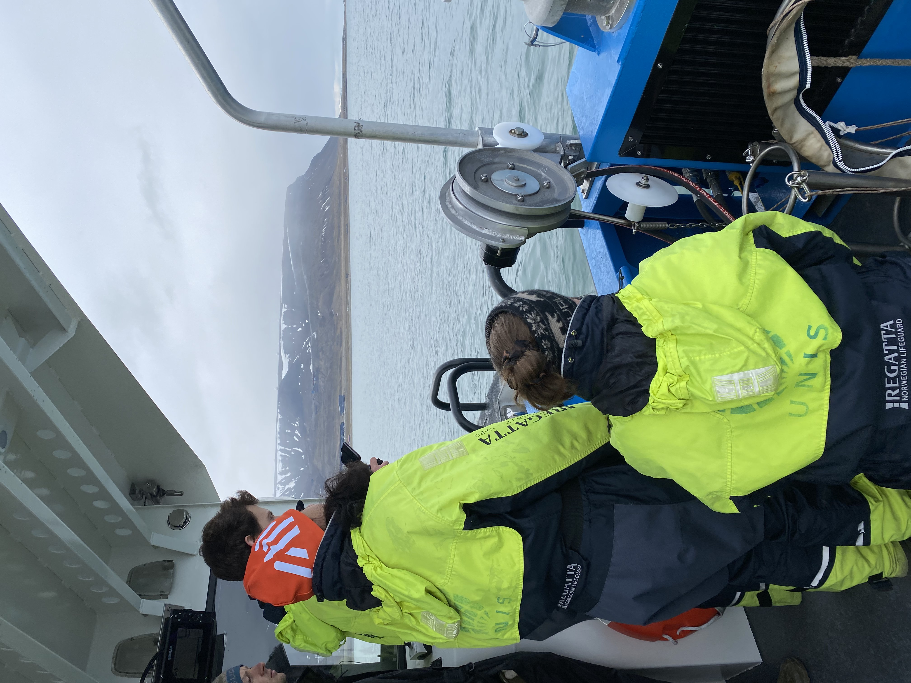{.field-photo}

*Students collecting environmental DNA samples.*
:::

::::

<video class="course-video" autoplay muted loop playsinline>
  <source src="images/course2_v.mp4" type="video/mp4">
</video>

<em>A little break to watch a pod of belugas swimming through the fjord!</em>

---

### AB-327/827 — Arctic Microbiology (Master's & PhD)

Contributed to teaching in Arctic microbial ecology, laboratory methods, microbial biodiversity, Arctic biogeochemistry and modern molecular and bioinformatic techniques used to study microorganisms in polar environments.

:::: {.columns}

::: {.column}
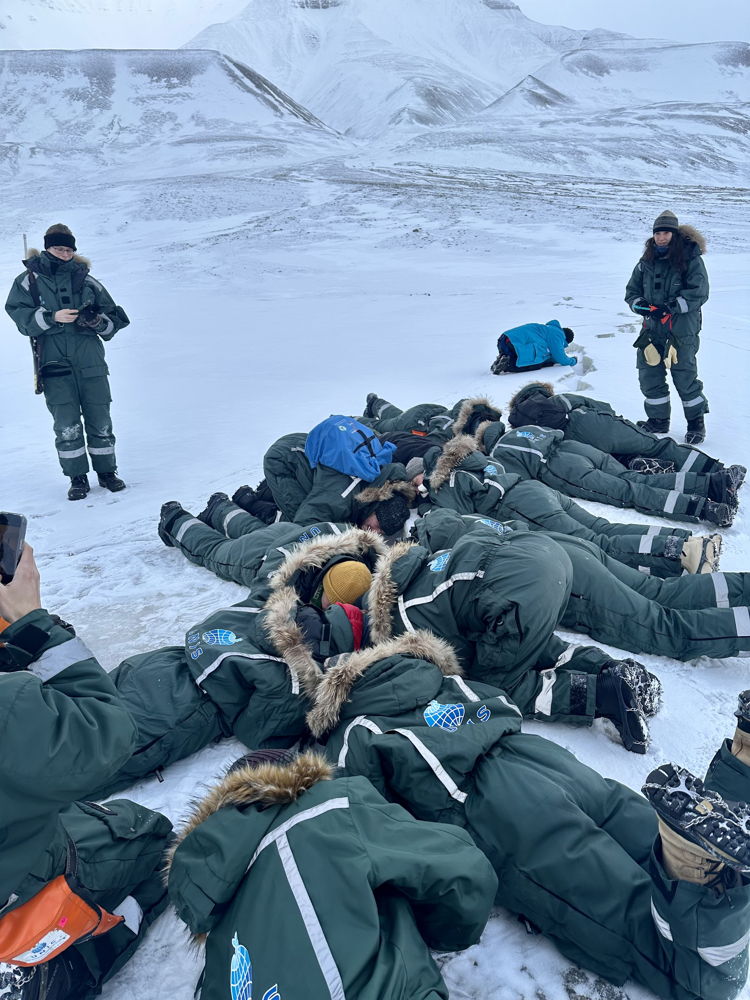{.field-photo}

:::

::: {.column}
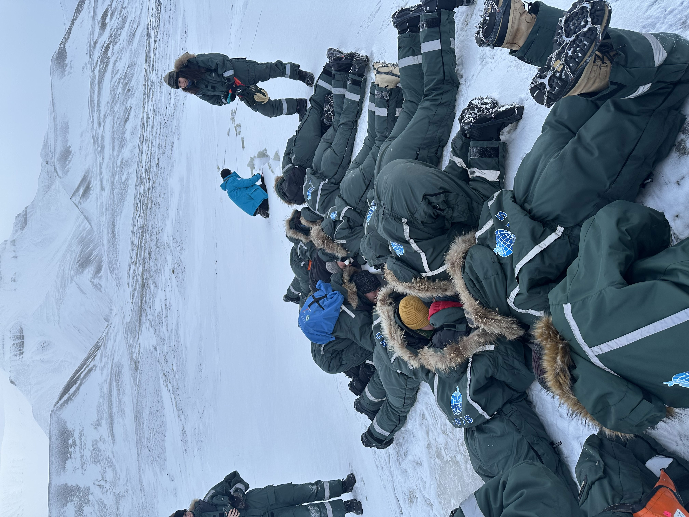{.field-photo}

:::

::::

<em>Students really digging into the pingo to hear the methane bubbles.</em>

:::: {.columns}

::: {.column}
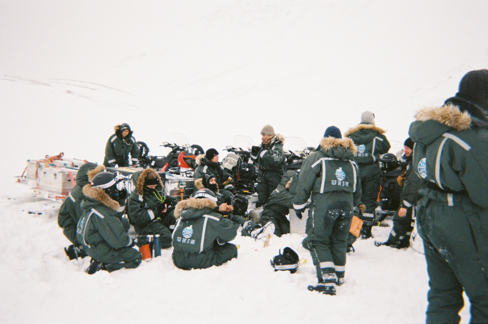{.field-photo}

*Prepping to start spring fieldwork*
:::

::: {.column}
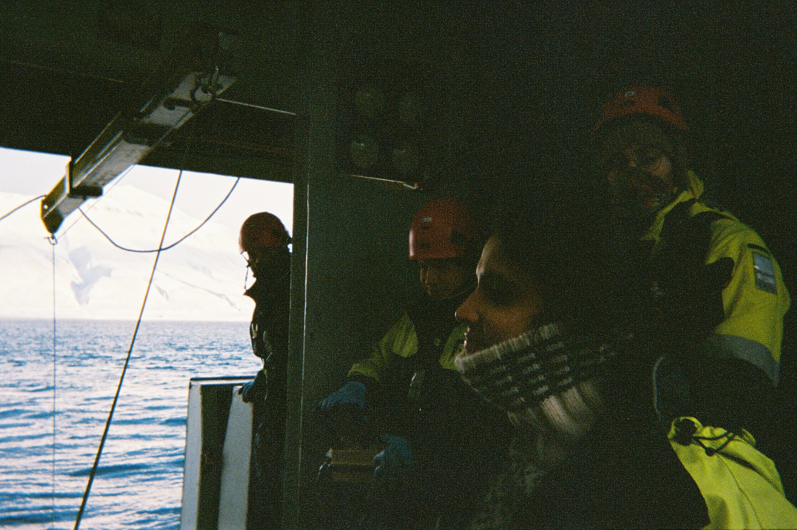{.field-photo}

*Cannot forget some marine fieldwork!*
:::

::::
# Student Mentorship

Alongside formal teaching, I have mentored and supervised undergraduate and Master's students, as well as bachelor interns, in all field- lab- and computer-based research.
Working closely with students on an individual basis has been one of the most rewarding aspects of teaching. It has provided the opportunity to tailor guidance to each student's goals, help them develop practical research skills and build confidence as future scientists.

This has included guidance in:

- Arctic field sampling
- Molecular laboratory techniques
- DNA metabarcoding workflows
- Data preparation and analysis

::: {.columns}

::: {.column}
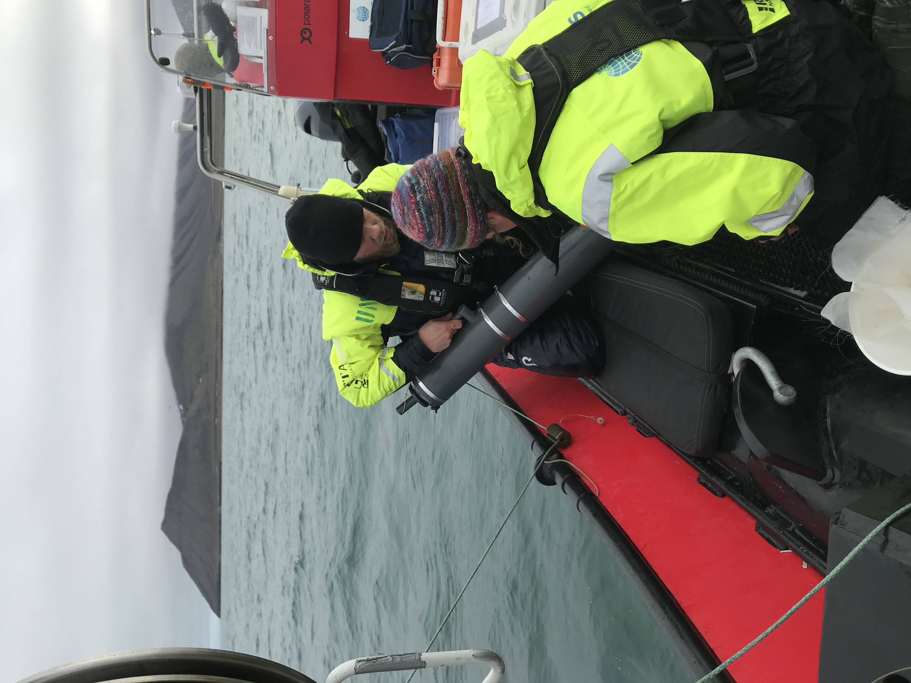{.field-photo-full}

*Summer fieldwork!*
:::

::: {.column}
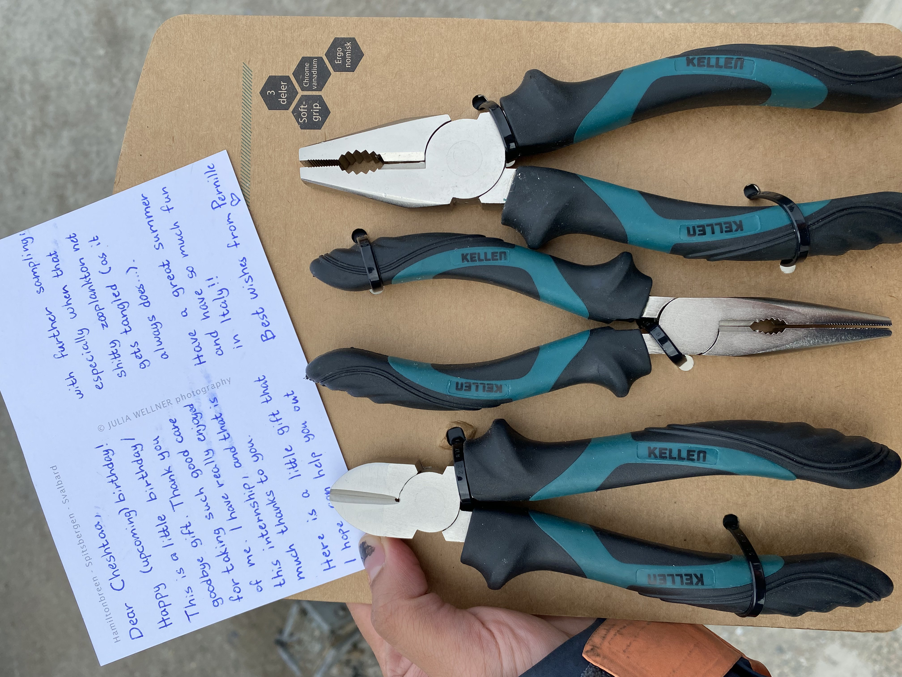{.field-photo-full}

:::

::::
